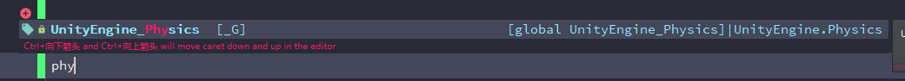
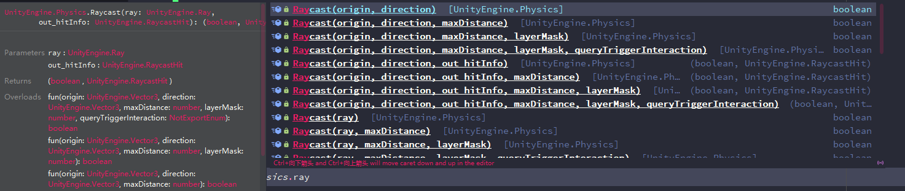
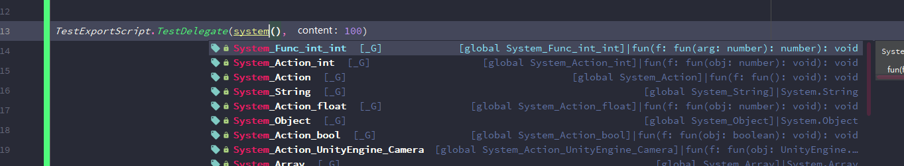
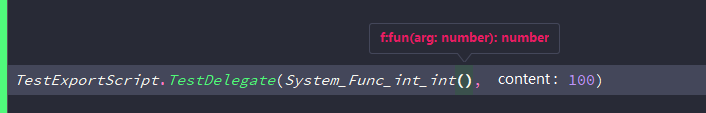

# EmmyLuaTypeGenerator

该项目功能基于[EmmyLua插件](https://github.com/EmmyLua/IntelliJ-EmmyLua)的注解功能,注解功能能够在Lua编写时引入类型系统,能够方便团队合作进行lua的开发.
对于Unity常用的Lua框架(ToLua/Xlua/Slua),在启动时会绑定一些c#导出类到Lua运行时中,但是这部分代码在lua中没有书写,所以ide无法做到智能提示,lua中操作c#代码带来了很多麻烦.

网上有一些已经写好的EmmyLua类型提示文件,但是对于我们自己导出的类型就没法使用类型提示了,通过该项目,可以自动将导出到lua的c#代码生成出lua类型注解文件供ide做代码补全.
*目前暂时只支持ToLua导出*

## 快速开始
主要代码在[文件夹](Assets/EmmyTypeGenerator/Editor)中的Generator.cs和ToLuaFacility.cs,将他们放入Unity工程中的某个Editor文件夹下,待编译完成后就可以准备使用了.
在Generator.cs的开头部分修改生成文件的路径和名称:
```csharp
        /// <summary>
        /// 该文件只用来给ide进行lua类型提示的,不要在运行时require该文件或者打包到版本中.
        /// </summary>
        private static string TypeDefineFilePath
        {
            get { return Application.dataPath + "/EmmyTypeGenerator/EmmyTypeDefine.lua"; }
        }

        /// <summary>
        /// 该文件需要在运行时require到lua虚拟机中,主要存放了大部分导出类型以及委托的全局引用
        /// </summary>
        private static string LuaGlobalVariableFilePath
        {
            get { return Application.dataPath + "/EmmyTypeGenerator/Lua/ExportTypeGlobalVariables.lua"; }
        }
```

## ToLua框架下
建议在Tolua的ToLuaMenu类的静态构造函数中(应该在ToLuaMenu.cs的第120行后)加入生成类型注解文件的调用:
```csharp
    static ToLuaMenu()
    {
        string dir = CustomSettings.saveDir;
        string[] files = Directory.GetFiles(dir, "*.cs", SearchOption.TopDirectoryOnly);

        if (files.Length < 3 && beCheck)
        {
            if (EditorUtility.DisplayDialog("自动生成", "点击确定自动生成常用类型注册文件， 也可通过菜单逐步完成此功能", "确定", "取消"))
            {
                beAutoGen = true;
                GenLuaDelegates();
                AssetDatabase.Refresh();
                GenerateClassWraps();
                GenLuaBinder();
                beAutoGen = false;        
                
                //这里自动调用类型文件生成
                EmmyTypeGenerator.Generator.GenerateEmmyTypeFiles();
            }

            beCheck = false;
        }
    }
```
这样在生成wrap文件时,就能够自动更新注解文件.
*另外ToLua在lua层面重写了部分Unity类型,该部分的类型注解已经手写在了对应的Lua文件中,他们在[这个文件夹](Assets/ToLua/Lua/UnityEngine/)中,直接下载覆盖ToLua中对应的文件即可,工具会忽略该部分类型的生成.*

> 在Lua菜单下,通过EmmyTypeGenerate选项也可以生成提示文件.

具体的例子文件在[test.lua](Assets/EmmyTypeGenerator/Lua/Test.lua).

当文件生成好后,应该就能够通过ide实现代码提示与补全.
例如要使用射线功能:

每一个方法包括重载会有详细的提示(参数名,多返回值):

对于out或ref形参,会在名称前加入"out_"或"ref_"前缀,方便阅读.

对于导出的委托类型,例如在CustomSetting中:
```csharp
    //附加导出委托类型(在导出委托时, customTypeList 中牵扯的委托类型都会导出， 无需写在这里)
    public static DelegateType[] customDelegateList = 
    {        
        _DT(typeof(Action)),                
        _DT(typeof(UnityEngine.Events.UnityAction)),
        _DT(typeof(System.Predicate<int>)),
        _DT(typeof(System.Action<int>)),
        _DT(typeof(System.Comparison<int>)),
        _DT(typeof(System.Func<int, int>)),
    };
```
会生成全局引用变量:
```lua
---@type fun(f : fun())
System_Action = System.Action
---@type fun(f : fun())
UnityEngine_Events_UnityAction = UnityEngine.Events.UnityAction
---@type fun(f : fun(obj : number) : boolean)
System_Predicate_int = System.Predicate_int
---@type fun(f : fun(obj : number))
System_Action_int = System.Action_int
---@type fun(f : fun(x : number, y : number) : number)
System_Comparison_int = System.Comparison_int
---@type fun(f : fun(arg : number) : number)
System_Func_int_int = System.Func_int_int
```
按照Tolua的委托调用规则,生成了详细的传入参数类型和返回类型,调用则直接使用即可,例如:




和Tolua的规则一样,对于customTypeList中牵扯到的委托类型,工具也都会自动导出,不用再单独写一份了.

### ToDo
tolua中对于list和dictionary这种泛型类型,提供了getItem和setItem之类的方法,通过反射来执行,需要生成对应的代码注解.